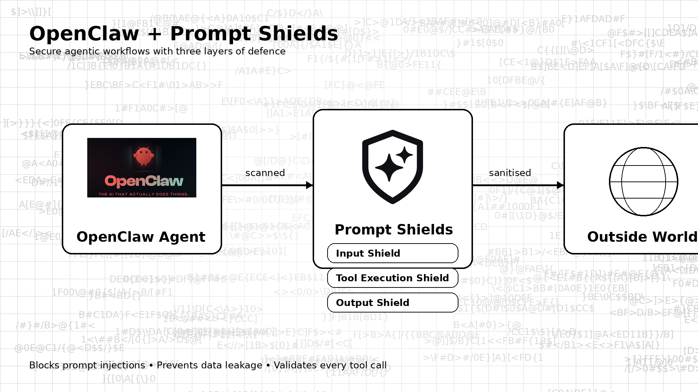

# OpenClaw Prompt Shield

[](LICENSE)

A policy layer that sits between a computer-use AI agent and the tools it invokes, validating every shell command, file operation, and network request before it executes.

## The problem

A computer-use agent is granted a shell, a filesystem, and outbound network access, and then handed untrusted text — a web page, a document, an email — as input. That is the whole attack: text the agent reads becomes instructions the agent follows, and the agent already holds your credentials. Your existing controls do not see it. Endpoint detection sees a legitimate process spawning legitimate subprocesses; a secure web gateway sees an allowed egress; data loss prevention sees a file read by an authorised user. The agent's tool calls are the only place where intent is observable, and by default nothing inspects them.

## Quickstart

```bash
git clone https://github.com/Prompt-Shields/openclaw-promptshield.git && cd openclaw-promptshield
python3 -m venv .venv && source .venv/bin/activate && pip install -r requirements.txt
export AZURE_CONTENT_SAFETY_ENDPOINT="https://<your-resource>.cognitiveservices.azure.com/"
export AZURE_CONTENT_SAFETY_KEY="<your-key>"
export SHIELD_MODE=monitoring && python3 -c "from openclaw_shield.shields import SecureToolExecutor; print('shields importable')"
```

Requires Python 3.9 or later and an Azure AI Content Safety resource. Start in `monitoring` mode, which logs decisions without blocking; switch to `enforcing` only once you have reviewed what it would have blocked. For a container deployment, populate the environment variables listed in `docker-compose.yml` and run `docker compose up -d`.

## How does it work?



**A tool shield is a validator that intercepts a single class of agent action — a shell command, a file operation, a network request — and returns an allow or deny decision with a reason, before the action reaches the operating system.** Four shields wrap the agent at three points on the request path.

```
   untrusted input (web page, document, user prompt)
                    |
                    v
   +--------------------------------------+
   | LAYER 1  Input Shield                |
   |   Azure Prompt Shield jailbreak      |
   |   and indirect-injection detection   |
   |   Azure Content Safety PII detection |
   +------------------+-------------------+
                      v
              agent (Claude computer use)
                      |
                      v   tool call
   +--------------------------------------+
   | LAYER 2  SecureToolExecutor          |
   |                                      |
   |   BashCommandShield ...... allowlist, dangerous-pattern
   |                            blocking, injection check on args
   |   FileOperationShield .... safe-path enforcement, credential
   |                            scan on write, Purview DLP labels
   |   NetworkShield .......... domain allowlist, URL parameter
   |                            injection check, response sanitising
   +------------------+-------------------+
              allow   |   deny -> logged, alerted, not executed
                      v
   +--------------------------------------+
   | Sandboxed execution                  |
   |   container, egress filtering,       |
   |   resource limits                    |
   +------------------+-------------------+
                      v
   +--------------------------------------+
   | LAYER 3  Output Shield               |
   |   credential leak detection,         |
   |   PII redaction, path stripping      |
   +--------------------------------------+
                      v
              response to user
                      |
                      +--> Azure Monitor / Application Insights
                           (every decision, allowed and blocked)
```

**`SecureToolExecutor` is the single entry point: you route the agent's tool calls through its `execute_tool` method instead of executing them directly**, and it dispatches to the shield matching the tool. Shields are subclassable, so an organisation-specific rule is an override rather than a fork.

```python
from openclaw_shield.shields import SecureToolExecutor

executor = SecureToolExecutor(
    azure_content_safety_endpoint=os.environ["AZURE_CONTENT_SAFETY_ENDPOINT"],
    azure_content_safety_key=os.environ["AZURE_CONTENT_SAFETY_KEY"],
)

async def execute_tool(tool_name: str, parameters: dict):
    return await executor.execute_tool(tool_name, parameters)
```

Every decision is emitted to Azure Monitor as a custom event, so blocked actions are queryable:

```kusto
customEvents
| where name == "ToolExecutionBlocked"
| extend tool = tostring(customDimensions.tool_name),
         reason = tostring(customDimensions.block_reason)
| summarize count() by tool, reason, bin(timestamp, 1h)
```

## What this does not do

This is a policy checkpoint, not a containment boundary. Treat it as defence in depth on top of a sandbox, never as a replacement for one.

- **It does not sandbox anything itself.** The isolation in the diagram is your container, your egress filter, your resource limits. This library decides; the operating system enforces. Running it against an agent with unrestricted host access buys you logging and very little else.
- **It cannot stop an agent that does not route through it.** Any tool path not passed to `SecureToolExecutor` is unshielded. There is no interception at the kernel or runtime level, and nothing prevents an agent, or a developer, from calling around it.
- **Injection detection is probabilistic and will be evaded.** Azure Prompt Shield is a classifier. Classifiers have a false negative rate, and prompt injection is an active research area where novel phrasings routinely defeat deployed detectors. A clean verdict is weak evidence, not a guarantee.
- **Allowlists are the actual control; the AI checks are secondary.** The dependable protection here is the bash command allowlist, the safe-path list, and the domain allowlist. Keep them tight. If your allowlist includes an interpreter — `python`, `node`, `bash` — you have granted arbitrary execution and the pattern blocking is decorative. Note that the shipped default allowlist does exactly that, and is a demonstration default, not a recommendation.
- **It does not defend against a malicious model or a compromised supply chain.** The threat model is an agent manipulated through its input. An agent whose weights, prompt, or dependencies are hostile is out of scope.
- **PII and credential detection is pattern and classifier based.** It will miss novel secret formats and free-text disclosure, and it will flag benign strings. Do not present its output as a completeness claim.
- **Requires Azure.** Content Safety is a hard dependency and Purview is optional; there is no offline or self-hosted detection path. Prompt text is sent to Azure for classification. Confirm that is acceptable under your data residency obligations before deploying.
- **This is reference-quality code, not a hardened product.** A single module, no test suite in this repository, no release process, and no independent security review. Read it before you rely on it.

## Free versus Prompt Shields Cloud

This repository is free and MIT-licensed in full, and stays that way. The boundary across the Prompt Shields product line: **anything an individual engineer needs is free; anything an organisation or an auditor needs is paid.** No capability moves from the free side to the paid side.

| | Free — this repository | Prompt Shields Cloud |
|---|---|---|
| Shields and policy enforcement | Complete, no feature gating | Same, plus managed detection models retrained continuously |
| Policy configuration | Environment variables, per deployment | Organisation-wide policy, versioning, approval workflows, environment promotion |
| Deployment | Self-hosted, single agent, single user | Managed, multi-project, multi-tenant |
| Decision logging | Your Azure Monitor workspace | Hosted retention, cross-project alerting and anomaly detection, OWASP LLM Top 10 and MITRE ATLAS mapping |
| Administration | None | SSO and SAML, SCIM, RBAC, audit trail of who changed which policy |
| Compliance evidence | None | Hash-chained tamper-evident audit logs, EU AI Act Article 12 exports, one-click incident reports |
| Data controls | Entirely yours | Bring-your-own keys, region pinning, air-gapped deployment |
| Support | Community issues, best effort | Service level agreements, named support, data processing agreement and penetration test report handling |

We do not monetise the code. We monetise hosting, enterprise controls, compliance evidence, and accountability.

## Links

- Documentation: [docs.promptshields.com](https://docs.promptshields.com); in-repository references are [API reference](docs/api-reference.md), [Purview integration](docs/purview-integration.md), and the [incident response playbook](docs/incident-response.md)
- Deployment: [DEPLOYMENT.md](DEPLOYMENT.md)
- Security policy: this repository has no `SECURITY.md`. Report vulnerabilities privately to security@promptshields.com, never via a public issue. The canonical policy is [prompt-shields-sdk/SECURITY.md](https://github.com/Prompt-Shields/prompt-shields-sdk/blob/main/SECURITY.md).
- Contributing: this repository has no `CONTRIBUTING.md`. Open a pull request against `main`; see [prompt-shields-sdk/CONTRIBUTING.md](https://github.com/Prompt-Shields/prompt-shields-sdk/blob/main/CONTRIBUTING.md) for the workflow we follow.
- Related: [Prompt Shields SDK](https://github.com/Prompt-Shields/prompt-shields-sdk), [Azure AI Content Safety](https://azure.microsoft.com/en-gb/products/ai-services/ai-content-safety)

## Licence

MIT — see [LICENSE](LICENSE).
